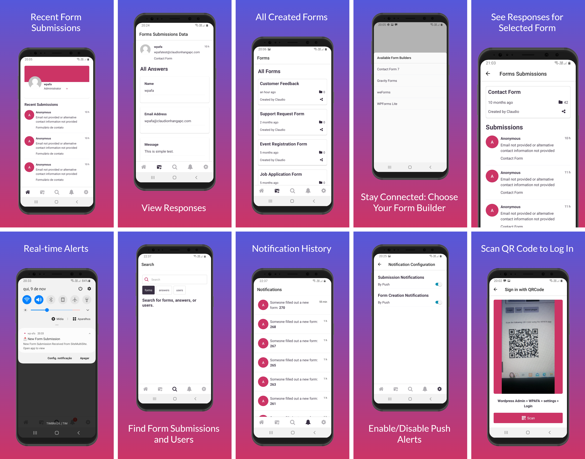

# WPAFA - Mobile-Ready Submission Manager App

Welcome to the WPAFA - Mobile-Ready Submission Manager App, a powerful mobile application designed to enhance your form management experience. This app seamlessly integrates with the WordPress Form Manager plugin, allowing you to manage form submissions on the go.



## Description

Our Expo app takes form management to the next level by providing you with the following features:

- **Mobile Access:** Access your WordPress form submissions from anywhere, right on your mobile device.

- **Integration:** Seamlessly integrate with popular WordPress form builders, enabling your users to oversee submissions conveniently.

- **Organization:** Stay organized with a user-friendly dashboard that allows you to view and manage form entries efficiently.

- **Insights:** Gain valuable insights into form submissions, helping you make data-driven decisions.

- **Enhanced User Experience:** Empower your users with a mobile app that simplifies form entry management.

With our Mobile-Ready Submission Manager App, you can revolutionize your approach to form management, increase productivity, and enhance user interactions.

## Getting Started

To get started with the Expo app, follow these steps:

1. **Installation:** Clone this repository to your local machine.

   ```bash
   git clone https://github.com/claudionhangapc/wp-afa-mobile-app.git
   ```

2. **Setup:** Install the required dependencies.

   ```bash
   cd wp-afa-mobile-app && yarn install
   ```

3. **Run:** Start the Expo development server.
   ```bash
   yarn start
   ```
4. **Testing:** You can now run the app on your local machine or on a physical or virtual mobile device using the Expo Go app.

Is it necessary to run `eas build` to generate an Expo project ID. This step is essential for enabling Expo push notifications to function correctly.

## Usage

- **Dashboard:** After logging in, users can access the dashboard, where they can view and manage form submissions.

- **Integration:** The app integrates seamlessly with popular WordPress form builders such as Contact Form 7, WPForms, Gravity Forms, and more.

- **Insights:** Dive into form submission data to gain valuable insights into user interactions.
